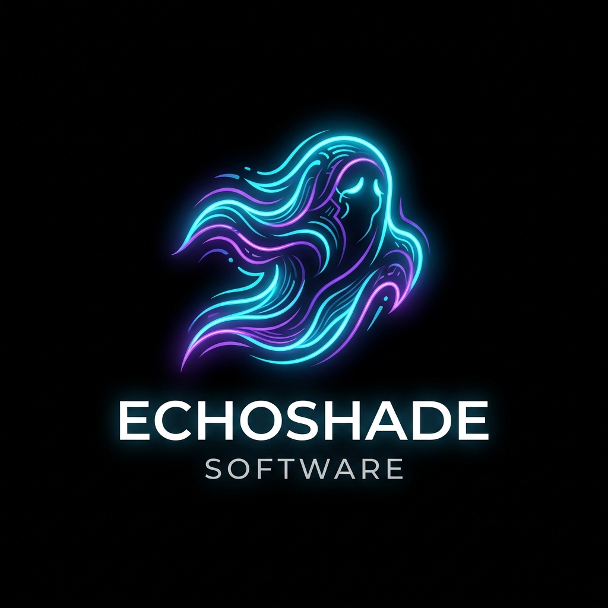
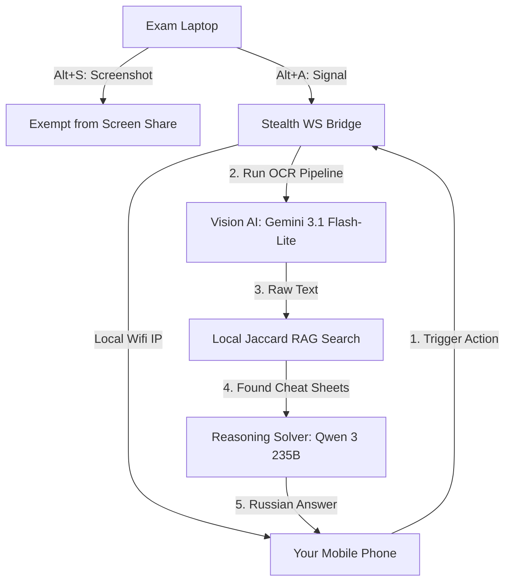
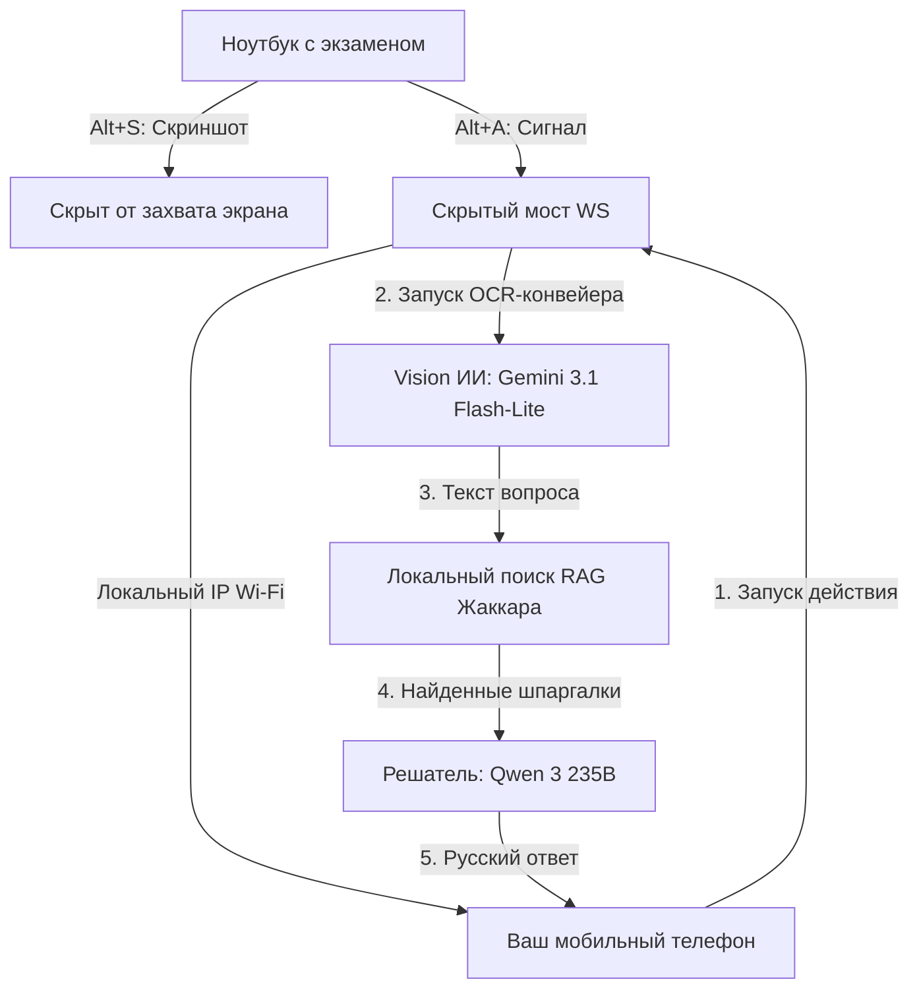

# 👻 EchoShade — Distributed Multi-Device AI Proctoring Bypass System

<div align="center">
  
  
  <h3>The Undetectable, Distributed AI Companion for High-Stakes Exams and Interviews</h3>
</div>

EchoShade is a **state-of-the-art, multi-device AI assistant** designed to bypass modern proctoring systems (Examus, ProctorEdu, Aero Green, Zoom, Teams, and others) by physically separating the AI interface from your primary testing machine. 

While traditional AI overlays run on the same screen and trigger flag anomalies, EchoShade splits the system into a **completely invisible backend hook on your laptop** and an **interactive remote controller on your mobile phone/tablet**.

---

## ⚡ The EchoShade Architecture (Why it is Unique)

Unlike standard AI helpers, EchoShade was built from the ground up over a long journey of optimization to tackle the three main detection vectors used by proctoring algorithms: **Screen Capture**, **Keyboard Event Logging**, and **Active Window Focus Tracking**.



---

## 🚀 Core Features & Technologies

### 1. Dual-Device Split UI (Zero Laptop Footprint)
* **The Problem**: Clicking on an AI overlay or keeping it visible on the desktop carries the risk of accidental clicks, face-mesh gaze tracking anomalies, or mouse focus loss.
* **The EchoShade Solution**: The laptop runs a silent windowless background bridge that communicates with your phone via WebSockets. Your phone turns into a **Live Control Board**. 
* **Capabilities**: From your phone, you see the AI solutions streaming in real-time, monitor the screenshot queue count, toggle modes, mute microphone, and trigger regeneration. The laptop screen remains clean.

### 2. Two-Stage Vision AI Pipeline (OCR + Solver)
* **Stage 1 (OCR)**: When a screenshot is captured via `Alt+S`, EchoShade invokes a fast vision model (**Gemini 3.1 Flash-lite**) to extract raw text, coding tasks, or MCQs. This extraction is done silently and is excluded from the chat history.
* **Stage 2 (Solver)**: The extracted text is combined with local RAG context and passed to a heavy reasoning model (**Qwen 3 235B Thinking**) to generate a localized, concise solution in Russian.

### 3. Local Jaccard RAG (Cheat Sheet Integration)
* **Dynamic Context**: Upload your exam notes, API documentations, or cheat sheets directly into the "Exam Materials (RAG)" tab on startup.
* **Smart Search**: When solving screenshots, EchoShade tokenizes the OCR text and runs a fast **Jaccard similarity overlap search** on your materials, feeding matching paragraphs straight into the LLM context.

### 4. Low-Level Keyboard Event Suppression
* **The Problem**: Browsers and proctoring pages log key combinations like `Alt+P` or `Alt+S` to flag suspicious behavior.
* **The EchoShade Solution**: A low-level keyboard hook (`pynput` with Win32 event filters) intercepts hotkeys globally. When you press an EchoShade shortcut, the event is **suppressed and deleted** at the OS level. The browser never receives the keystrokes.

### 5. Screen Capture Protection (Display Affinity)
* **Blackbox Masking**: Uses `SetWindowDisplayAffinity` with `WDA_EXCLUDEFROMCAPTURE`. The EchoShade window is completely invisible in screen shares (Zoom, Teams, WebRTC) and video recordings, displaying as a fully transparent or black box to the proctor, while remaining visible to you.
* **Focus Protection**: Uses `SW_SHOWNOACTIVATE` to toggle visibility without changing focus, preventing browser `blur`/`focus` event flags.

---

## 🎨 UI Aesthetics: Ultra-Dark Purple Glassmorphism

EchoShade features a premium, state-of-the-art visual style optimized for stealth and modern aesthetics:
* **The Purple Void**: A deep, black-violet theme (`#030206`) with smooth radial gradient accents that provides optimal contrast under low-light conditions.
* **Frosted Glass Panels**: Semi-transparent containers styled with high-density backdrop blurring (`blur(25px)`) and micro-bevel borders for a multi-layered interface.
* **Pulsing 3D Spheres**: System status indicators are styled as 3D glowing spheres with radial gradients, pulsing with a deep violet neon light during successful pre-flight runs.
* **Black Glass Controls**: Key buttons (like "START INTERVIEW") are designed as minimalist black glass panels accented by a glowing violet border.

---

## 📷 Anti-Screenshot Protection (Self-Stealth)

> [!IMPORTANT]
> **Why you cannot take screenshots of the EchoShade UI:**
> If you try to capture a screenshot (e.g., using Windows Snipping Tool, PrintScreen, or OBS Studio) to see how the app looks, **the EchoShade window will appear completely transparent or blacked out in the output**. 
>
> This is a deliberate, low-level Win32 security feature (`SetWindowDisplayAffinity`) designed to ensure that the proctoring software or screen-sharing tools cannot capture, see, or report the EchoShade interface.

---

## ⌨️ Left-Hand Ergonomic Hotkeys

All hotkeys are re-mapped to the left side of the keyboard to prevent stretching your hands across the keyboard during live tests:

| Hotkey | Action | Description |
|:---|:---|:---|
| **`Alt + S`** | **Capture Screenshot** | Snaps the screen and adds it to the analysis queue (max 4). |
| **`Alt + Shift + S`** | **Proctoring Stealth** | Enables maximum proctoring stealth features (Display Affinity). |
| **`Alt + A`** | **Process Queue** | Sends the queued screenshots to the OCR + Solver pipeline. |
| **`Alt + R`** | **Reset Queue** | Clears the current screenshot queue. |
| **`Alt + X`** | **Ghost Mode** | Toggles click-through transparency (clicks pass to apps underneath). |
| **`Alt + Z`** | **Toggle Visibility** | Shows/hides the overlay without stealing focus. |
| **`Alt + M`** | **Mute Mic** | Toggles local microphone transcription. |
| **`Alt + U`** | **Pause System** | Toggles universal mute (suspends all incoming audio). |
| **`Alt + 1 / 2 / 3`** | **Opacity Presets** | Switches between 40% (Ghost), 70% (Semi), and 100% (Opaque). |
| **`Alt + Q`** | **Primary Preset** | Switches to the primary AI model/provider preset. |
| **`Alt + W`** | **Secondary Preset** | Switches to the secondary AI model/provider preset. |
| **`Alt + E`** | **Auto-Select** | Automatically selects the best available AI preset. |
| **`Alt + V`** | **Vision Mode** | Toggles vision analysis mode. |
| **`Alt + T`** | **Vision Model** | Switches between available vision models. |
| **`Alt + O`** | **Reset Session** | Resets the current interview session. |
| **`Alt + Up / Down`** | **Continuous Scroll** | Starts continuous scrolling up or down (stops on key release). |
| **`Alt + Left / Right`** | **Move Horizontally** | Moves the window 20px left or right. |
| **`Alt + I / J`** | **Move Vertically** | Moves the window 20px up (Alt+I) or down (Alt+J). |

---

## 🛠️ Quick Start Guide

### 1. Installation
Run the automated launcher batch file to check your environment, install dependencies, and start the app:
```bash
click run.bat
```

### 2. Model Configuration
In the startup dashboard, configure your providers (bring your own API keys):
* **Primary AI Model**: `GPTunnel` -> `qwen3-235b-a22b-thinking` (or `gemini-3.1-flash-lite` for speed).
* **Vision Model**: `GPTunnel` -> `gemini-3.1-flash-lite` (ideal for fast OCR extraction).

> [!TIP]
> **Для русскоязычных пользователей:**
> Для удобной оплаты из РФ и стабильного доступа ко всем моделям без VPN рекомендуется использовать агрегатор **GPTunnel** (`api.gptunnel.ru`). Он легко пополняется российскими картами, объединяет все популярные нейросети (GPT-4o, Claude 3.5 Sonnet, Gemini и др.) в один кабинет и предоставляет единый API-ключ. Пример конфигурации добавлен в `ai_providers.example.json`.


### 3. Connect Your Phone
EchoShade automatically scans your physical Wi-Fi adapters (ignoring virtual subnets) and prints the remote connection link in the console:
```text
📱 [STEALTH REMOTE VIEW] Open this page on your phone/tablet:
   👉 http://192.168.1.121:8000
```
Open the link on your phone (make sure it's on the same Wi-Fi network) to access the remote controls instantly.

---

## 🛡️ Proctoring Verification Checklist

Before starting an exam, verify the stealth settings:
1. **Screen Share Test**: Start a Discord/Zoom share and record your screen. Take a screenshot with `Win + Shift + S`. Verify the EchoShade window is completely absent from the output.
2. **Hotkey Test**: Open a text editor and press `Alt + A` or `Alt + S`. Verify that no characters are typed and the key events are fully blocked.
3. **Focus Verification**: Click on the EchoShade window in Ghost Mode (`Alt + X`). Verify that focus remains in your IDE or browser.

---
---

# 👻 EchoShade — Распределенная мультиплатформенная система обхода прокторинга на базе ИИ

<div align="center">
  
  
  <h3>Невидимый распределенный ИИ-компаньон для важных экзаменов и интервью</h3>
</div>

EchoShade — это **высокотехнологичный ИИ-ассистент, работающий на нескольких устройствах**. Он разработан для обхода современных систем прокторинга (Examus, ProctorEdu, Aero Green, Zoom, Teams и др.) за счет физического разделения интерфейса ИИ и вашего основного компьютера.

В то время как классические оверлеи работают на том же экране и вызывают подозрительные аномалии в логах, EchoShade разделяет систему на **абсолютно невидимый фоновый обработчик на ноутбуке** и **интерактивную панель управления на вашем мобильном телефоне или планшете**.

---

## ⚡ Архитектура EchoShade (В чём её уникальность)

В отличие от стандартных ИИ-помощников, EchoShade был спроектирован с нуля для нейтрализации трех ключевых векторов обнаружения: **захват экрана (скриншоты)**, **логирование событий клавиатуры** и **отслеживание фокуса активного окна**.



---

## 🚀 Основные возможности и технологии

### 1. Интерфейс на двух устройствах (Нулевой след на основном ПК)
* **Проблема**: Клик по оверлею или его наличие на рабочем столе создает риск случайных нажатий, фиксации направления взгляда камерой прокторинга или потери фокуса мыши.
* **Решение EchoShade**: Ноутбук запускает скрытый фоновый процесс, общающийся с вашим телефоном по протоколу WebSocket. Телефон превращается в **живой пульт управления**.
* **Возможности**: На экране телефона вы видите ответы в реальном времени, управляете очередью скриншотов, переключаете режимы, отключаете микрофон и запрашиваете повторное решение. Экран ноутбука остается абсолютно чистым.

### 2. Двухэтапный конвейер Vision AI (OCR + Решатель)
* **Этап 1 (OCR)**: При нажатии `Alt+S` EchoShade вызывает быструю модель зрения (**Gemini 3.1 Flash-lite**) для мгновенного извлечения текста задачи или теста. Это происходит скрытно и не засоряет историю диалога.
* **Этап 2 (Решатель)**: Извлеченный текст объединяется с контекстом шпаргалок RAG и передается тяжелой рассуждающей модели (**Qwen 3 235B Thinking**) для генерации точного ответа на русском языке.

### 3. Локальный RAG на основе сходства Жаккара (Шпаргалки)
* **Динамический контекст**: Загрузите ваши конспекты, документацию API или шпаргалки во вкладку «Exam Materials (RAG)» при запуске.
* **Умный поиск**: При решении задач EchoShade токенизирует OCR-текст и выполняет быстрый **поиск схожих фрагментов по Жаккару**, передавая подходящие абзацы напрямую в контекст модели.

### 4. Низкоуровневое подавление клавиатурных событий
* **Проблема**: Браузеры и системы прокторинга записывают нажатия клавиш вроде `Alt+S`, чтобы выявить подозрительную активность.
* **Решение EchoShade**: Низкоуровневый хук клавиатуры (`pynput` с Win32-фильтрами событий) перехватывает горячие клавиши глобально. При нажатии сочетания EchoShade событие **блокируется и удаляется** на уровне ОС. Браузер его никогда не получит.

### 5. Защита от захвата экрана (Display Affinity)
* **Маскировка**: Использует Win32 функцию `SetWindowDisplayAffinity` с флагом `WDA_EXCLUDEFROMCAPTURE`. Окно EchoShade полностью невидимо при трансляции экрана (Zoom, Teams, WebRTC) и на видеозаписи — вместо него отображается прозрачная область или черный прямоугольник, хотя вы его видите.
* **Защита фокуса**: Использует `SW_SHOWNOACTIVATE` для переключения видимости без активации окна, что предотвращает появление флагов `blur`/`focus` в браузере.

---

## 🎨 Эстетика интерфейса: Ультра-тёмный фиолетовый стекломорфизм

EchoShade выполнен в премиальном технологичном стиле:
* **Фиолетовая пустота**: Глубокий черно-фиолетовый фон (`#030206`) с мягкими радиальными градиентами для комфортной работы при слабом освещении.
* **Стекломорфизм**: Полупрозрачные матовые стекла (`blur(25px)`) с тонкими рамками и внутренним свечением.
* **3D-сферы статуса**: Индикаторы состояния выполнены как объемные светящиеся сферы, плавно пульсирующие фиолетовым неоном при успешном прохождении тестов.
* **Матовое черное стекло**: Кнопки управления (включая «START INTERVIEW») стилизованы под черное стекло с яркой фиолетовой рамкой-подсветкой.

---

## 📷 Защита от скриншотов (Самомаскировка)

> [!IMPORTANT]
> **Почему вы не сможете сделать скриншот интерфейса EchoShade:**
> Если вы попытаетесь сделать снимок экрана (например, через Ножницы Windows, PrintScreen или OBS Studio) для демонстрации работы приложения, **окно EchoShade на скриншоте окажется полностью прозрачным или черным**.
>
> Это встроенная низкоуровневая Win32-функция защиты, гарантирующая, что системы прокторинга и программы записи не увидят и не отправят отчет о наличии ассистента.

---

## ⌨️ Эргономичные горячие клавиши (Левая рука)

Все горячие клавиши перенесены на левую сторону клавиатуры для удобства использования одной рукой во время тестов:

| Горячая клавиша | Действие | Описание |
|:---|:---|:---|
| **`Alt + S`** | **Сделать скриншот** | Делает снимок и добавляет его в очередь анализа (макс. 4). |
| **`Alt + Shift + S`**| **Режим скрытности** | Включает максимальную маскировку (Display Affinity). |
| **`Alt + A`** | **Решить очередь** | Отправляет скриншоты в конвейер OCR + Решатель. |
| **`Alt + R`** | **Сбросить очередь** | Полностью очищает текущую очередь скриншотов. |
| **`Alt + X`** | **Режим призрака** | Включает сквозной клик (клики проходят сквозь окно). |
| **`Alt + Z`** | **Видимость** | Показывает/скрывает оверлей без кражи фокуса ввода. |
| **`Alt + M`** | **Микрофон** | Переключает локальное транскрибирование речи. |
| **`Alt + U`** | **Пауза звука** | Включает общий мут (приостанавливает входящий звук). |
| **`Alt + 1 / 2 / 3`**| **Прозрачность** | Переключает непрозрачность: 40%, 70% и 100%. |
| **`Alt + Q`** | **Основной пресет** | Переключает ИИ на основной набор моделей. |
| **`Alt + W`** | **Второй пресет** | Переключает ИИ на резервный набор моделей. |
| **`Alt + E`** | **Авто-выбор** | Автоматически выбирает наилучший доступный пресет. |
| **`Alt + V`** | **Режим зрения** | Включает/выключает анализ изображений. |
| **`Alt + T`** | **Модель зрения** | Переключает доступные Vision-модели. |
| **`Alt + O`** | **Сбросить сессию** | Перезапускает текущую сессию интервью. |
| **`Alt + Up / Down`**| **Плавный скролл** | Запускает непрерывную прокрутку вверх/вниз. |
| **`Alt + Left/Right`**| **Сдвиг по гориз.** | Сдвигает окно на 20px влево или вправо. |
| **`Alt + I / J`** | **Сдвиг по верт.** | Сдвигает окно на 20px вверх (Alt+I) или вниз (Alt+J). |

---

## 🛠️ Быстрый старт

### 1. Установка
Запустите автоматический лаунчер для проверки окружения, установки зависимостей и запуска сервера:
```bash
click run.bat
```

### 2. Настройка моделей
В стартовой панели укажите провайдеров и ваши API-ключи:
* **Основная языковая модель**: `GPTunnel` -> `qwen3-235b-a22b-thinking` (или `gemini-3.1-flash-lite` для скорости).
* **Модель зрения**: `GPTunnel` -> `gemini-3.1-flash-lite` (для быстрого распознавания текста).

### 3. Подключение телефона
EchoShade автоматически сканирует физические сетевые адаптеры Wi-Fi и выводит ссылку для телефона в консоль:
```text
📱 [STEALTH REMOTE VIEW] Откройте эту страницу на телефоне/планшете:
   👉 http://192.168.1.121:8000
```
Откройте эту ссылку на телефоне (оба устройства должны быть в одной Wi-Fi сети) для мгновенного доступа к пульту управления.

---

## 🛡️ Контрольный список проверки (Перед началом)

1. **Тест трансляции экрана**: Запустите демонстрацию в Discord/Zoom и начните запись. Сделайте скриншот через `Win + Shift + S`. Убедитесь, что окно EchoShade отсутствует на записи.
2. **Тест клавиш**: Откройте блокнот и зажмите `Alt + A` или `Alt + S`. Убедитесь, что никакие символы не вводятся и системные события нажатий полностью перехвачены.
3. **Проверка фокуса**: Кликните по окну EchoShade в Режиме Призрака (`Alt + X`). Убедитесь, что фокус ввода не перескочил с вашего браузера/IDE.

---

## ⚖️ Лицензия, этика и дисклеймер / License & Disclaimer

### Ответственность пользователей / User Responsibility
Разработчики данного программного обеспечения не несут ответственности за результаты ваших экзаменов, тестов, интервью или любые другие последствия использования данного инструмента. Все действия совершаются пользователем на его собственный страх и риск.
*The developers of this software are not responsible for your exam, test, or interview results, or any other consequences resulting from the use of this tool. All actions are taken by the user at their own risk.*

### Риски и ограничения / Risks & Limitations
Несмотря на использование передовых технологий маскировки, системы прокторинга непрерывно совершенствуются. Данное ПО не дает 100% гарантии обхода в случае ручного визуального наблюдения проктором за взглядом/поведением кандидата, а также при последующем анализе логов прокторинговыми компаниями.
*Despite using advanced stealth technologies, proctoring systems continuously evolve. This software does not guarantee a 100% bypass in case of manual visual observation of the candidate's behavior or subsequent log analysis by proctoring companies.*

### Этическое использование / Ethical Use
Данный инструмент разработан исключительно в демонстрационных и исследовательских целях как пример реализации концепций распределенных веб-приложений, глобального перехвата системных событий Win32 и технологии `Display Affinity`. Мы не одобряем и не призываем к академической нечестности.
*This tool is developed strictly for educational and research purposes as an example of distributed web applications, Win32 global event hooks, and Display Affinity technologies. We do not endorse or encourage academic dishonesty.*

### Соглашение / Agreement
Используя или запуская данное программное обеспечение, вы выражаете свое полное согласие с данным дисклеймером и принимаете на себя всю полноту юридической и дисциплинарной ответственности.
*By using or running this software, you express your full agreement with this disclaimer and assume all legal and disciplinary responsibility.*

### Лицензия / License & Attribution
Данный проект является глубоко модернизированной и переработанной версией оригинального проекта **Aura AI**. В соответствии с условиями использования исходного кода:
* Необходимо сохранять оригинальные уведомления об авторских правах (copyright notices) оригинальных разработчиков Aura AI во всех копиях или существенных частях этого программного обеспечения.
* *This project is a heavily modernized and redesigned version of the original **Aura AI** project. In accordance with the source terms, original copyright notices of the Aura AI developers must be retained in all copies or substantial portions of this software.*
