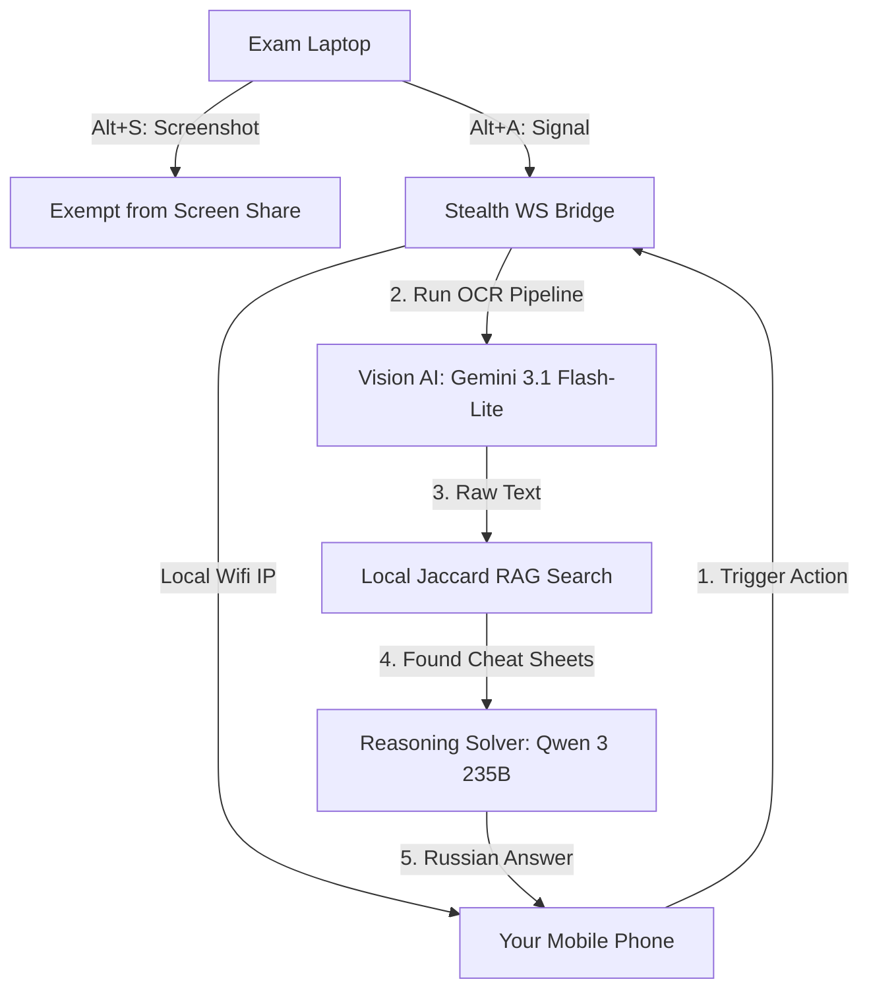

# 👻 EchoShade — Distributed Multi-Device AI Proctoring Bypass System

<div align="center">
  
  
  <h3>The Undetectable, Distributed AI Companion for High-Stakes Exams and Interviews</h3>
</div>

EchoShade is a **state-of-the-art, multi-device AI assistant** designed to bypass modern proctoring systems (Examus, ProctorEdu, Aero Green, Zoom, Teams, and others) by physically separating the AI interface from your primary testing machine. 

While traditional AI overlays run on the same screen and trigger flag anomalies, EchoShade splits the system into a **completely invisible backend hook on your laptop** and an **interactive remote controller on your mobile phone/tablet**.

---

## ⚡ The EchoShade Architecture (Why it is Unique)

Unlike standard AI helpers, EchoShade was built from the ground up over a long journey of optimization to tackle the three main detection vectors used by proctoring algorithms: **Screen Capture**, **Keyboard Event Logging**, and **Active Window Focus Tracking**.



---

## 🚀 Core Features & Technologies

### 1. Dual-Device Split UI (Zero Laptop Footprint)
* **The Problem**: Clicking on an AI overlay or keeping it visible on the desktop carries the risk of accidental clicks, face-mesh gaze tracking anomalies, or mouse focus loss.
* **The EchoShade Solution**: The laptop runs a silent windowless background bridge that communicates with your phone via WebSockets. Your phone turns into a **Live Control Board**. 
* **Capabilities**: From your phone, you see the AI solutions streaming in real-time, monitor the screenshot queue count, toggle modes, mute microphone, and trigger regeneration. The laptop screen remains clean.

### 2. Two-Stage Vision AI Pipeline (OCR + Solver)
* **Stage 1 (OCR)**: When a screenshot is captured via `Alt+S`, EchoShade invokes a fast vision model (**Gemini 3.1 Flash-lite**) to extract raw text, coding tasks, or MCQs. This extraction is done silently and is excluded from the chat history.
* **Stage 2 (Solver)**: The extracted text is combined with local RAG context and passed to a heavy reasoning model (**Qwen 3 235B Thinking**) to generate a localized, concise solution in Russian.

### 3. Local Jaccard RAG (Cheat Sheet Integration)
* **Dynamic Context**: Upload your exam notes, API documentations, or cheat sheets directly into the "Exam Materials (RAG)" tab on startup.
* **Smart Search**: When solving screenshots, EchoShade tokenizes the OCR text and runs a fast **Jaccard similarity overlap search** on your materials, feeding matching paragraphs straight into the LLM context.

### 4. Low-Level Keyboard Event Suppression
* **The Problem**: Browsers and proctoring pages log key combinations like `Alt+P` or `Alt+S` to flag suspicious behavior.
* **The EchoShade Solution**: A low-level keyboard hook (`pynput` with Win32 event filters) intercepts hotkeys globally. When you press an EchoShade shortcut, the event is **suppressed and deleted** at the OS level. The browser never receives the keystrokes.

### 5. Screen Capture Protection (Display Affinity)
* **Blackbox Masking**: Uses `SetWindowDisplayAffinity` with `WDA_EXCLUDEFROMCAPTURE`. The EchoShade window is completely invisible in screen shares (Zoom, Teams, WebRTC) and video recordings, displaying as a fully transparent or black box to the proctor, while remaining visible to you.
* **Focus Protection**: Uses `SW_SHOWNOACTIVATE` to toggle visibility without changing focus, preventing browser `blur`/`focus` event flags.

---

## 🎨 UI Aesthetics: Ultra-Dark Purple Glassmorphism

EchoShade features a premium, state-of-the-art visual style optimized for stealth and modern aesthetics:
* **The Purple Void**: A deep, black-violet theme (`#030206`) with smooth radial gradient accents that provides optimal contrast under low-light conditions.
* **Frosted Glass Panels**: Semi-transparent containers styled with high-density backdrop blurring (`blur(25px)`) and micro-bevel borders for a multi-layered interface.
* **Pulsing 3D Spheres**: System status indicators are styled as 3D glowing spheres with radial gradients, pulsing with a deep violet neon light during successful pre-flight runs.
* **Black Glass Controls**: Key buttons (like "START INTERVIEW") are designed as minimalist black glass panels accented by a glowing violet border.

---

## 📷 Anti-Screenshot Protection (Self-Stealth)

> [!IMPORTANT]
> **Why you cannot take screenshots of the EchoShade UI:**
> If you try to capture a screenshot (e.g., using Windows Snipping Tool, PrintScreen, or OBS Studio) to see how the app looks, **the EchoShade window will appear completely transparent or blacked out in the output**. 
>
> This is a deliberate, low-level Win32 security feature (`SetWindowDisplayAffinity`) designed to ensure that the proctoring software or screen-sharing tools cannot capture, see, or report the EchoShade interface.

---

## ⌨️ Left-Hand Ergonomic Hotkeys

All hotkeys are re-mapped to the left side of the keyboard to prevent stretching your hands across the keyboard during live tests:

| Hotkey | Action | Description |
|:---|:---|:---|
| **`Alt + S`** | **Capture Screenshot** | Snaps the screen and adds it to the analysis queue (max 4). |
| **`Alt + Shift + S`** | **Proctoring Stealth** | Enables maximum proctoring stealth features (Display Affinity). |
| **`Alt + A`** | **Process Queue** | Sends the queued screenshots to the OCR + Solver pipeline. |
| **`Alt + R`** | **Reset Queue** | Clears the current screenshot queue. |
| **`Alt + X`** | **Ghost Mode** | Toggles click-through transparency (clicks pass to apps underneath). |
| **`Alt + Z`** | **Toggle Visibility** | Shows/hides the overlay without stealing focus. |
| **`Alt + M`** | **Mute Mic** | Toggles local microphone transcription. |
| **`Alt + U`** | **Pause System** | Toggles universal mute (suspends all incoming audio). |
| **`Alt + 1 / 2 / 3`** | **Opacity Presets** | Switches between 40% (Ghost), 70% (Semi), and 100% (Opaque). |
| **`Alt + Q`** | **Primary Preset** | Switches to the primary AI model/provider preset. |
| **`Alt + W`** | **Secondary Preset** | Switches to the secondary AI model/provider preset. |
| **`Alt + E`** | **Auto-Select** | Automatically selects the best available AI preset. |
| **`Alt + V`** | **Vision Mode** | Toggles vision analysis mode. |
| **`Alt + T`** | **Vision Model** | Switches between available vision models. |
| **`Alt + O`** | **Reset Session** | Resets the current interview session. |
| **`Alt + Up / Down`** | **Continuous Scroll** | Starts continuous scrolling up or down (stops on key release). |
| **`Alt + Left / Right`** | **Move Horizontally** | Moves the window 20px left or right. |
| **`Alt + I / J`** | **Move Vertically** | Moves the window 20px up (Alt+I) or down (Alt+J). |

---

## 🛠️ Quick Start Guide

### 1. Installation
Run the automated launcher batch file to check your environment, install dependencies, and start the app:
```bash
click run.bat
```

### 2. Model Configuration
In the startup dashboard, configure your providers (bring your own API keys):
* **Primary AI Model**: `GPTunnel` -> `qwen3-235b-a22b-thinking` (or `gemini-3.1-flash-lite` for speed).
* **Vision Model**: `GPTunnel` -> `gemini-3.1-flash-lite` (ideal for fast OCR extraction).

> [!TIP]
> **Для русскоязычных пользователей:**
> Для удобной оплаты из РФ и стабильного доступа ко всем моделям без VPN рекомендуется использовать агрегатор **GPTunnel** (`api.gptunnel.ru`). Он легко пополняется российскими картами, объединяет все популярные нейросети (GPT-4o, Claude 3.5 Sonnet, Gemini и др.) в один кабинет и предоставляет единый API-ключ. Пример конфигурации добавлен в `ai_providers.example.json`.


### 3. Connect Your Phone
EchoShade automatically scans your physical Wi-Fi adapters (ignoring virtual subnets) and prints the remote connection link in the console:
```text
📱 [STEALTH REMOTE VIEW] Open this page on your phone/tablet:
   👉 http://192.168.1.121:8000
```
Open the link on your phone (make sure it's on the same Wi-Fi network) to access the remote controls instantly.

---

## 🛡️ Proctoring Verification Checklist

Before starting an exam, verify the stealth settings:
1. **Screen Share Test**: Start a Discord/Zoom share and record your screen. Take a screenshot with `Win + Shift + S`. Verify the EchoShade window is completely absent from the output.
2. **Hotkey Test**: Open a text editor and press `Alt + A` or `Alt + S`. Verify that no characters are typed and the key events are fully blocked.
3. **Focus Verification**: Click on the EchoShade window in Ghost Mode (`Alt + X`). Verify that focus remains in your IDE or browser.
